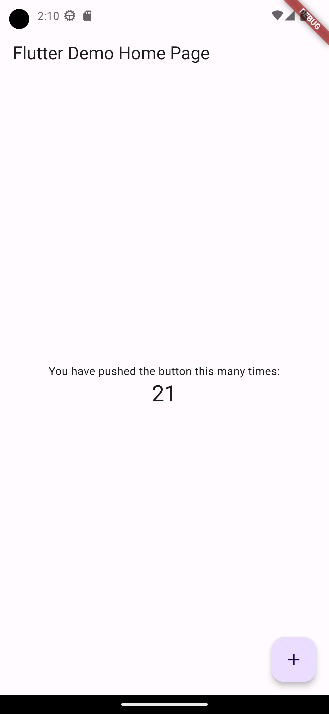
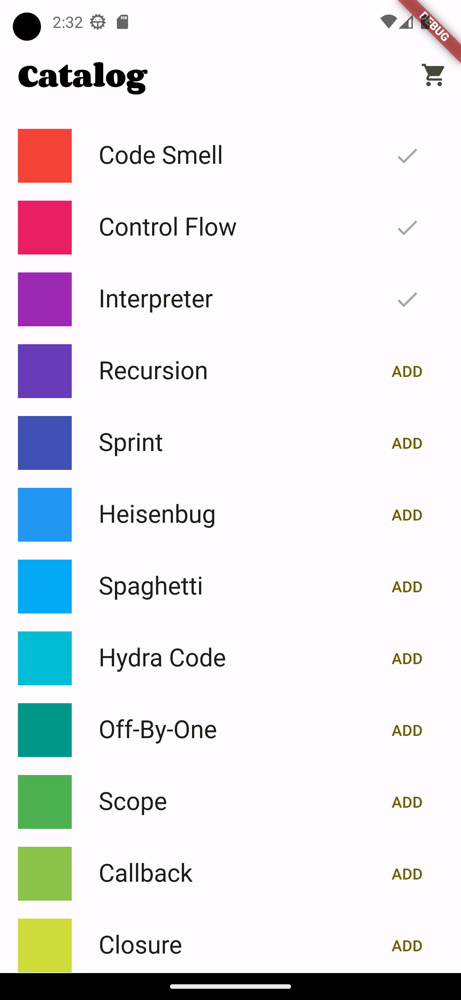
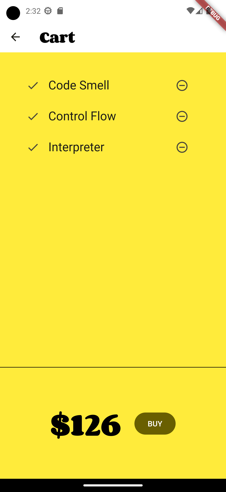

# Evidência que os aplicativos foram colocados para funcionar

## provider_counter

## provider_shopper

# Alterações feitas

## Exemplo 1
- Comando flutter pub get executado
- Dependência analysis_default substituída por analysis_options devido ao fato do pacote não ter sido encontrado.

## Exemplo 2
- Comando flutter pub get executado
- Dependência analysis_default substituída por analysis_options devido ao fato do pacote não ter sido encontrado.
